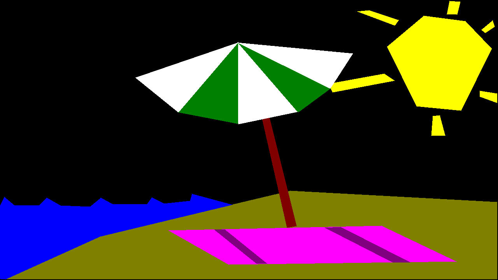

# "FunDraw" v1.0.0

A simple shape painting toy written in Python with PyGame

## Controls

| Key          | Action                               |
| ------------ | ------------------------------------ |
| Left Click   | Select new point for current polygon |
| Scroll Wheel | Change color of curent polygon       |
| Right Click  | Complete polygon                     |
| Ctrl+S       | Save and name image                  |

By Douglas J. Honeycutt

